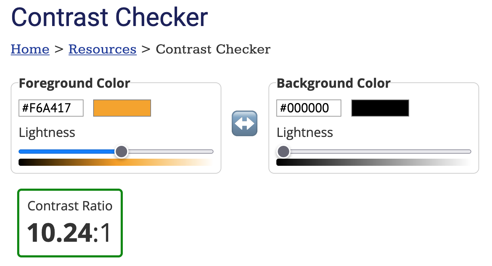

# horse-riding-club
## [Link to Github classroom](https://github.com/Medieinstitutet/fed21d-grafiska-verktyg-djungelvral)

## [DEMO](https://horse-riding-club.netlify.app/)

## [Link to Figma](https://www.figma.com/file/PYd2Xfm7XCZRlUSmu9uGCg/RidingClub?node-id=1%3A2)

## About the design

This is the homepage of a horse riding club in England that can be enjoyed by children and adults alike. We chose a soothing gray for adults and a cheerful yellow for children.

The image of a horse eating carrots and the horse logo represent the friendliness of the horse riding club. We draw attention to the subscription field by the glowing "subscribe" text.

## Graphics & Guidelines

#### Logo:

 In exchange for creating horse logo for free, we must place the following credit somewhere on this homepage.
 footer is best.

Logo is <a href="https://www.designevo.com/jp/" title="free online logo maker">DesignEvo</a> Made by logomaker

Create favicon with the logo.

#### Button:

'Submit' & 'Accept' buttons becomes a hover. Specify the color in Figma.

#### Typography:

Increase the font size of the first letter of 'about-us' items.

#### Color:

The footer color is gradation. #FED469 to #f 6a417. Specify other colors in Figma.

#### Accessibility:

#### Animation:

The header is animated from left to right.

The 'about us' items are displayed in chronological order from left to right.

The logo rotates clockwise.

Subscribe text flashes.

